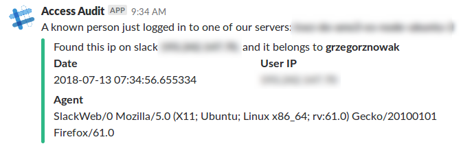

# Ansible Role: SSH Login Notifications


Installs scripts to send notifications (by mail and/or Slack) when an user logs in using SSH.

The scripts uses *pam_exec.so* in the PAM *open session* event to detect the login.

## Requirements

This role has been tested in Ubuntu 14.04 and Ubuntu 16.04 but it should be valid for any distribution that uses the PAM Linux system.

## Role Variables

The variables that can be passed to this role and a brief description about them are as follows.

```
  # Notifications by email, set it to true to activate or false to deactivate
ssh_login_notifications_mail_enable: true
  #
  # Set the e-mail notification receiver
ssh_login_notifications_mail_receiver: "root"
  #
  # Notifications by Slack, set it to true to activate or false to deactivate
ssh_login_notifications_slack_enable: false
  #
  # Set the Slack custom integration webhook URL
ssh_login_notifications_slack_webhook: ""
  #
  # Keep track of IPs that logged in and only report to slack if a new one logs in
  # NOTE: There isn't an email conterpart since normally you want your email log to be as detailed as possible
  # for better forensic analysis
  # Seen IPs' log is kept as a plaintext file under /var/log/ansible-ssh-login-notification.log
ssh_login_notifications_slack_only_unique: true
  #
  # For fully-fledged experience provide spottmedia's auditapp API keys you received for each of your workspaces
ssh_login_notifications_auditapp_keys: ["1234", "2345"]             # required: a list of API key strings

# optional: a list of channels' names where UNKNOWN successfull logins will be reported
ssh_login_notifications_slack_app_channel_alert: ["alert_channel1", "alert_channel2"]

# optional: a list of channels' names where KNOWN successfull logins will be reported
ssh_login_notifications_slack_app_channel_logging: ["logging_channel1", "logging_channel2"]  

  # consider a list of known IPs, such as monitors, CIs etc, as safe to not report back at all upon login
ssh_login_notifications_slack_known_ips: ["127.0.0.1", "192.168.0.1"] # defaults to an empty list, populate with a list of string

```

Notifications previously activated with this role can be deactivated by setting the variable to *false*. 


## Dependencies

#### (optional) a SLACK APP

##### Extra features it provides when created

* can query workspace in search for user IPs and map it against ssh sessions
* uses alternative python-driven routine and slack API to deliver messages, and is the only 
way we plan supporting and extending atm
* so more to come!


## Example output (when using slack app integration)

##### When a user was succesfully mapped


_please note it carries over agent as well for possibly better forensic analysis)_


##### When we couldn't map against the Slack's workspace log


##### Installation

To install the role just look at it's [ansible galaxy page](https://galaxy.ansible.com/grzegorznowak/ansible_ssh_login_notifications)


For the slack integration you need to create an app with 
those permission scopes added and the app attached to your workspace: 

````
admin 	(this one is quite heavy but unfortunatelly is the only way to come around fetching workspace user's IPs)
chat:write:bot 	
chat:write:user 	
incoming-webhook 

````
_(For more details on how apps work on slack see: https://api.slack.com/slack-apps)_


## Example Playbook

```
- hosts: server
  roles:
    - { role: grzegorznowak.ansible_ssh_login_notifications }
```


## Roadmap (only the slack notification for now)

* rotate entries out of list of ips based on (configurable) datetime, so we remember only the most recent ones ( WIP )
* use more fine-grained control of already stored IP, specifically understand pub keys that were used to log in ( WIP )
* ability to provide additional list of permanent known ips, in cases of own servers accessing a site often

### Stretch goals
* when an IP is not mapped against any known store, create an interactive slack box so people can confirm it was them
* streamline the whole process by creating a multi-workspace app with oauth

##### More to come...

## License

MIT / BSD

## Sponsored by

#### [Kwiziq.com](https://www.kwiziq.com) - The AI language education platform
#### [Spottmedia.com](http://www.spottmedia.com) - Technology design, delivery and consulting


## Author Information

python, ansible, slack & shell coding by [Grzegorz Nowak](https://www.linkedin.com/in/grzegorz-nowak-356b7360/) and Spottmedia.


the initial code was a fork from a work of:
[Fernando Membrive](https://github.com/membrive/ansible-role-ssh-login-notifications).
